# Vehicle Service Management System
### 🚗 Pega Infinity Capstone Project & Interactive Portal Demo

An enterprise-grade Vehicle Service & Repair Management Application built using **Pega Infinity Low-Code Platform**, **Pega GenAI Blueprint**, and modern **Constellation UI Architecture**. 

This application automates the full vehicle lifecycle from customer intake, diagnostics & multi-point inspections, itemized cost estimations, and automated technician routing, to quality audits and digital service delivery.

---

## 📌 Case Lifecycle Architecture

The end-to-end case lifecycle (`Submit Vehicle Service Request`) is divided into 5 structured stages:

```mermaid
graph LR
    subgraph Stage 1: Request Intake
        A[Customer Details] --> B[Vehicle Specs & Symptoms]
    end
    subgraph Stage 2: Inspection Diagnosis
        C[Checklist Review] --> D[Log Diagnostic Findings]
    end
    subgraph Stage 3: Estimate Approval
        E[Itemize Labor & Parts] --> F[Auto Calculate Cost & Taxes]
    end
    subgraph Stage 4: Service Execution
        G[Repair Execution] --> H[Quality Inspection]
    end
    subgraph Stage 5: Service Completion
        I[Completion Summary] --> J[Resolve Case]
    end
    B --> C
    D --> E
    F --> G
    H --> I
```

---

## 🛠️ Key Technical Features & Capabilities

* **Case Lifecycle Management (CLM):** Multi-stage workflow managing service requests from submission to final vehicle handover.
* **Declarative Calculations:** Real-time calculation of labor hours, parts replacement costs, local taxes (8%), and grand totals.
* **Role-Based Routing & Work Queues:** Assignment routing to dedicated personas (`Service Advisor`, `Technician: tech1@vehicle.com`, `Quality Manager`).
* **Data Modeling & External Tables:** Relational data schemas for `Customer`, `Vehicle`, `Service Estimate`, and `Vehicle Inspection Report`.
* **Constellation Design System:** Fast, accessible, React-based portal experience with responsive multi-column forms and smart AI fill assistants.

---

## 🚀 Live Interactive Demo

Try the interactive browser prototype hosted on GitHub Pages:
👉 **[Open Live Demo Portal](https://likisai.github.io/pega-vehicle-service-management/)**

---

## 📂 Repository Contents

* `index.html` - Interactive Pega Constellation Case Worker Portal replica.
* `styles.css` - Custom styling matching Pega Infinity design tokens and glassmorphism.
* `app.js` - Case state machine, dynamic cost calculator, and stage progression logic.
* `pega_setup_manual.md` - Complete setup and configuration guide for Pega Academy / Dev Studio.
* `Vehicle_Service_Management.blueprint` - Exported Pega GenAI Blueprint JSON package.

---

## 🧑‍💻 Author
**Vehicle Service Management Project Team**  
Built as part of Pega Academy Training & Capstone Program.
